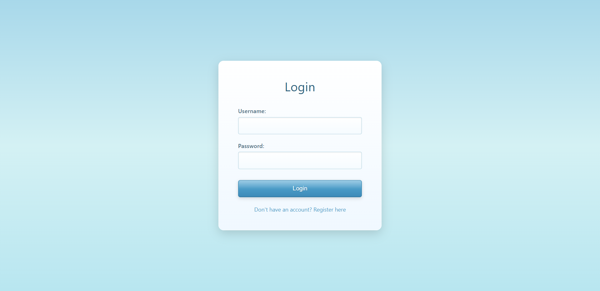
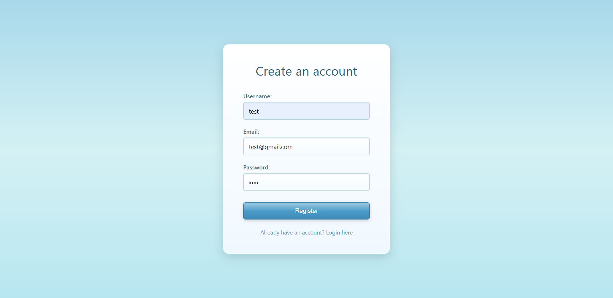
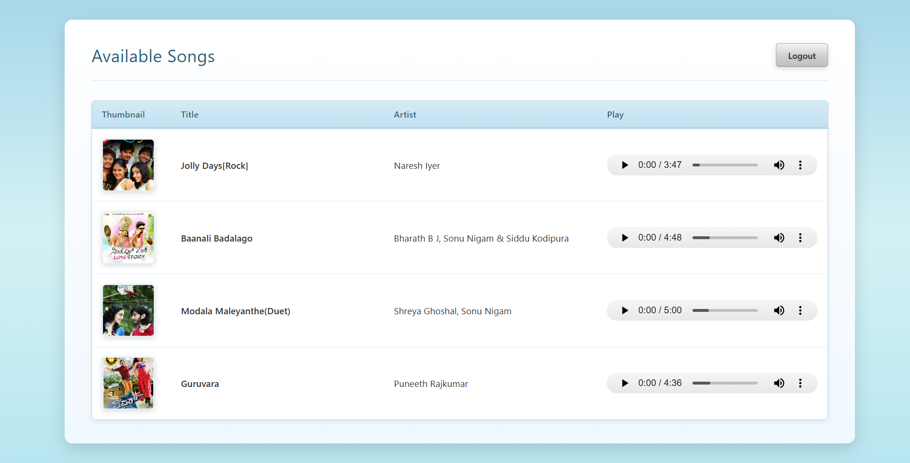
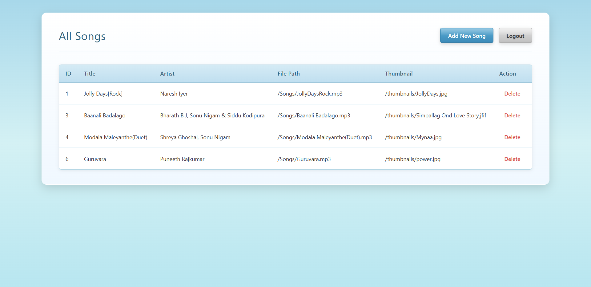
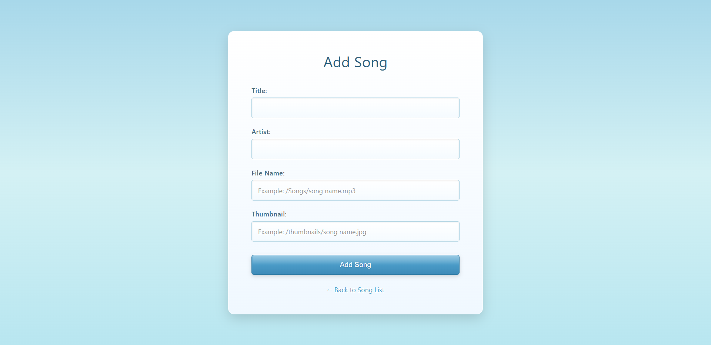

# 🎵 Meowsic - Online Music Streaming Application

A web-based music streaming application built with Jakarta EE, featuring a nostalgic Y2K/Frutiger Aero design aesthetic. Meowsic allows users to browse and play songs while providing administrators with full song management capabilities.


---

## 🎬 Preview

### Demo Video

Watch Meowsic in action:

https://github.com/user-attachments/assets/demo.mp4

> **Note**: If the video doesn't play inline, you can [download it here](preview/demo.mp4) or view it in the `preview/` folder.

### Screenshots

#### Login Page

*Clean and simple login interface with Y2K aesthetic*

#### Registration Page

*User-friendly registration form*

#### User Song Library

*Browse and play songs with an intuitive grid layout*

#### Admin Dashboard

*Admin interface for managing the music library*

#### Add Song (Admin)

*Easy-to-use form for adding new songs to the library*

---

## 📋 Table of Contents

- [Features](#-features)
- [Technology Stack](#-technology-stack)
- [Project Structure](#-project-structure)
- [Prerequisites](#-prerequisites)
- [Installation & Setup](#-installation--setup)
- [Database Configuration](#-database-configuration)
- [Running the Application](#-running-the-application)
- [User Guide](#-user-guide)
- [Admin Guide](#-admin-guide)
- [Design Philosophy](#-design-philosophy)
- [API Endpoints](#-api-endpoints)
- [Troubleshooting](#-troubleshooting)
- [Contributing](#-contributing)

---

## ✨ Features

### User Features
- 🎧 **Browse Songs** - View all available songs with thumbnails
- ▶️ **Stream Music** - Play songs directly in the browser with HTML5 audio player
- 🔒 **Secure Authentication** - User registration and login system
- 📱 **Responsive Design** - Works seamlessly on desktop and mobile devices
- 🎨 **Y2K Aesthetic** - Nostalgic 2000s-inspired UI with glossy buttons and soft gradients

### Admin Features
- ➕ **Add Songs** - Upload new songs to the library
- 🗑️ **Delete Songs** - Remove songs from the database
- 📊 **Manage Library** - View and manage all songs in the system
- 🔐 **Admin Dashboard** - Dedicated admin interface for song management

### Security Features
- 🔐 **Password Hashing** - Secure password storage using SHA-256 hashing
- 👤 **Role-Based Access** - Separate user and admin roles
- 🛡️ **Session Management** - Secure session handling
- 🚫 **Download Protection** - Audio controls configured to prevent downloads

---

## 🛠️ Technology Stack

### Backend
- **Java 21** - Core programming language
- **Jakarta EE** - Enterprise Java specifications
- **Hibernate 6.5.2** - ORM framework for database operations
- **MySQL 8.3.0** - Relational database
- **Maven** - Dependency management and build tool

### Frontend
- **HTML5** - Structure and semantic markup
- **CSS3** - Styling with Y2K/Frutiger Aero design
  - CSS Grid for layouts
  - Gradient backgrounds
  - Glassmorphism effects
  - Smooth animations
- **JSP (JavaServer Pages)** - Dynamic content rendering
- **JSTL 3.0** - Tag library for JSP

### Server
- **Apache Tomcat 10+** - Servlet container
- **Jakarta Servlet API** - Web application framework

---

## 📁 Project Structure

```
Meowsic/
├── src/
│   ├── main/
│   │   ├── java/
│   │   │   └── com/meowsic/
│   │   │       ├── controller/
│   │   │       │   ├── admin/
│   │   │       │   │   ├── AdminAddSongServlet.java
│   │   │       │   │   ├── AdminDeleteSongServlet.java
│   │   │       │   │   └── AdminSongListServlet.java
│   │   │       │   ├── auth/
│   │   │       │   │   ├── LoginServlet.java
│   │   │       │   │   ├── LogoutServlet.java
│   │   │       │   │   └── RegisterServlet.java
│   │   │       │   └── user/
│   │   │       │       ├── PlaySongServlet.java
│   │   │       │       └── UserSongsListServlet.java
│   │   │       ├── dao/
│   │   │       │   ├── SongDAO.java
│   │   │       │   └── UserDAO.java
│   │   │       ├── daoimpl/
│   │   │       │   ├── SongDAOImpl.java
│   │   │       │   └── UserDAOImpl.java
│   │   │       ├── entity/
│   │   │       │   ├── Role.java
│   │   │       │   ├── Song.java
│   │   │       │   └── User.java
│   │   │       ├── service/
│   │   │       │   ├── AuthService.java
│   │   │       │   ├── RegisterService.java
│   │   │       │   └── SongService.java
│   │   │       └── util/
│   │   │           ├── HibernateUtil.java
│   │   │           └── PasswordUtil.java
│   │   ├── resources/
│   │   │   └── hibernate.cfg.xml
│   │   └── webapp/
│   │       ├── admin/
│   │       │   ├── add-song.jsp
│   │       │   └── admin-song-list.jsp
│   │       ├── user/
│   │       │   └── user-song-list.jsp
│   │       ├── Songs/
│   │       ├── thumbnails/
│   │       ├── WEB-INF/
│   │       │   └── web.xml
│   │       ├── login.html
│   │       └── register.html
│   └── test/
├── pom.xml
└── README.md
```

---

## 📦 Prerequisites

Before you begin, ensure you have the following installed:

- **Java Development Kit (JDK) 17 or higher**
  - Download from [Oracle](https://www.oracle.com/java/technologies/downloads/) or [OpenJDK](https://openjdk.org/)
  - Verify: `java -version`

- **Apache Maven 3.6+**
  - Download from [Maven](https://maven.apache.org/download.cgi)
  - Verify: `mvn -version`

- **MySQL Server 8.0+**
  - Download from [MySQL](https://dev.mysql.com/downloads/mysql/)
  - Verify: `mysql --version`

- **Apache Tomcat 10.1+**
  - Download from [Tomcat](https://tomcat.apache.org/download-10.cgi)

- **IDE (Optional but recommended)**
  - Eclipse IDE for Enterprise Java and Web Developers
  - IntelliJ IDEA Ultimate
  - VS Code with Java extensions

---

## 🚀 Installation & Setup

### 1. Clone the Repository

```bash
git clone https://github.com/yourusername/Meowsic.git
cd Meowsic
```

### 2. Configure MySQL Database

Create a new database for Meowsic:

```sql
CREATE DATABASE meowsic_db;
USE meowsic_db;
```

### 3. Update Hibernate Configuration

Edit `src/main/resources/hibernate.cfg.xml`:

```xml
<property name="hibernate.connection.url">jdbc:mysql://localhost:3306/meowsic_db</property>
<property name="hibernate.connection.username">your_mysql_username</property>
<property name="hibernate.connection.password">your_mysql_password</property>
```

### 4. Build the Project

```bash
mvn clean install
```

This will:
- Download all dependencies
- Compile the Java code
- Run tests (if any)
- Package the application as a WAR file in `target/Meowsic-0.0.1-SNAPSHOT.war`

### 5. Deploy to Tomcat

**Option A: Manual Deployment**
1. Copy the WAR file from `target/` to Tomcat's `webapps/` directory
2. Start Tomcat server
3. Access the application at `http://localhost:8080/Meowsic-0.0.1-SNAPSHOT/`

**Option B: IDE Deployment**
1. Configure Tomcat server in your IDE
2. Add the project to the server
3. Start the server from IDE
4. Access at `http://localhost:8080/Meowsic/`

---

## 🗄️ Database Configuration

### Hibernate Auto-Configuration

Meowsic uses Hibernate with auto-DDL enabled. The database schema will be automatically created on first run.

**Tables Created:**
- `users` - User accounts and credentials
- `songs` - Song metadata and file paths

### Manual Schema Creation (Optional)

If you prefer to create tables manually:

```sql
CREATE TABLE users (
    id INT AUTO_INCREMENT PRIMARY KEY,
    username VARCHAR(50) UNIQUE NOT NULL,
    email VARCHAR(100) UNIQUE NOT NULL,
    password VARCHAR(255) NOT NULL,
    role ENUM('user', 'admin') DEFAULT 'user'
);

CREATE TABLE songs (
    id INT AUTO_INCREMENT PRIMARY KEY,
    title VARCHAR(255) NOT NULL,
    artist VARCHAR(255) DEFAULT 'unknown artist',
    file_name VARCHAR(500) NOT NULL,
    image_url VARCHAR(500) DEFAULT 'thumbnails/default.jpg'
);
```

### Initial Admin User

Create an admin user manually or through the registration page and update the role:

```sql
-- After registering through the UI, update the role
UPDATE users SET role = 'admin' WHERE username = 'admin1';
```

---

## ▶️ Running the Application

### Start the Server

```bash
# If using Tomcat standalone
cd /path/to/tomcat/bin
./startup.sh  # Linux/Mac
startup.bat   # Windows
```

### Access the Application

- **Home/Login**: `http://localhost:8080/Meowsic/login.html`
- **Register**: `http://localhost:8080/Meowsic/register.html`
- **User Dashboard**: `http://localhost:8080/Meowsic/user/songs` (after login)
- **Admin Dashboard**: `http://localhost:8080/Meowsic/admin/songs` (admin only)

### Default Port Configuration

If port 8080 is in use, modify Tomcat's `server.xml`:

```xml
<Connector port="9090" protocol="HTTP/1.1"
           connectionTimeout="20000"
           redirectPort="8443" />
```

---

## 👤 User Guide

### Registration

1. Navigate to the registration page
2. Fill in:
   - Username (unique)
   - Email address
   - Password
3. Click "Register"
4. You'll be redirected to the login page

### Login

1. Enter your username and password
2. Click "Login"
3. You'll be redirected to the song list

### Browsing & Playing Songs

1. After login, you'll see the song library
2. Each song displays:
   - **Thumbnail** - Album art or song image
   - **Title** - Song name
   - **Artist** - Artist name(s)
   - **Audio Player** - HTML5 player with controls
3. Click the play button to stream music
4. Use the audio controls to:
   - Play/Pause
   - Seek through the track
   - Adjust volume
   - (Download is disabled)

### Logout

Click the "Logout" button in the top-right corner

---

## 👨‍💼 Admin Guide

### Accessing Admin Panel

1. Login with an admin account
2. Navigate to `/admin/songs`
3. **Username**: admin1
4. **Password**: admin@123 (Has to to be seeded manually, Don't forget to hash it before storing. You will find the hashing program in `com.meowsic.util.PasswordUtil`)

### Adding Songs

1. Click "Add New Song" button
2. Fill in the form:
   - **Title**: Song name (required)
   - **Artist**: Artist name (required)
   - **File Name**: Path to audio file (required)
     - Example: `/Songs/song_name.mp3`
   - **Thumbnail**: Path to image file (optional)
     - Example: `/thumbnails/song_name.jpg`
3. Click "Add Song"

**Note**: Audio files should be placed in `webapp/Songs/` directory and thumbnails in `webapp/thumbnails/`

### Managing Songs

The admin song list displays:
- Song ID
- Title
- Artist
- File path
- Thumbnail URL
- Delete action

### Deleting Songs

1. Find the song in the list
2. Click the "Delete" link
3. Song will be removed from the database

---

## 🎨 Design Philosophy

### Y2K/Frutiger Aero Aesthetic

Meowsic embraces the nostalgic design language of the early 2000s:

**Visual Elements:**
- **Soft Blue Gradients** - Sky blue backgrounds (#a8d8ea → #d4f1f4)
- **Glossy Buttons** - Multi-stop gradients with glass reflections
- **Subtle Shadows** - Depth without harsh contrasts
- **Rounded Corners** - Smooth, friendly interfaces
- **Clean Typography** - Segoe UI, Trebuchet MS

**Design Principles:**
- **Simplicity** - Clean, readable layouts
- **Consistency** - Unified design across all pages
- **Nostalgia** - Windows Vista/7 era inspiration
- **Functionality** - Form follows function

### Responsive Design

- **Desktop**: Full grid layout with all columns visible
- **Tablet**: Adjusted spacing and sizing
- **Mobile**: Single-column layout, hidden headers

---

## 🔌 API Endpoints

### Authentication

| Method | Endpoint | Description | Access |
|--------|----------|-------------|--------|
| POST | `/login` | User login | Public |
| POST | `/register` | User registration | Public |
| GET | `/logout` | User logout | Authenticated |

### User Endpoints

| Method | Endpoint | Description | Access |
|--------|----------|-------------|--------|
| GET | `/user/songs` | List all songs | User |
| GET | `/user/play-song` | Stream a song | User |

### Admin Endpoints

| Method | Endpoint | Description | Access |
|--------|----------|-------------|--------|
| GET | `/admin/songs` | List all songs (admin view) | Admin |
| GET | `/admin/add-song.jsp` | Add song form | Admin |
| POST | `/admin/add-song` | Create new song | Admin |
| GET | `/admin/delete-song` | Delete a song | Admin |

---

## 🐛 Troubleshooting

### Common Issues

#### 1. Database Connection Error

**Problem**: `Could not create connection to database server`

**Solution**:
- Verify MySQL is running: `sudo systemctl status mysql`
- Check credentials in `hibernate.cfg.xml`
- Ensure database exists: `SHOW DATABASES;`
- Check firewall settings

#### 2. Port Already in Use

**Problem**: `Address already in use: bind`

**Solution**:
- Change Tomcat port in `server.xml`
- Or kill the process using port 8080:
  ```bash
  # Linux/Mac
  lsof -i :8080
  kill -9 <PID>
  
  # Windows
  netstat -ano | findstr :8080
  taskkill /PID <PID> /F
  ```

#### 3. 404 Not Found

**Problem**: Page not found errors

**Solution**:
- Verify WAR deployment in `webapps/`
- Check context path in URL
- Review `web.xml` servlet mappings
- Check Tomcat logs: `logs/catalina.out`

#### 4. Audio Not Playing

**Problem**: Audio player shows but doesn't play

**Solution**:
- Verify audio files exist in `webapp/Songs/`
- Check file paths in database
- Ensure audio format is supported (MP3, WAV, OGG)
- Check browser console for errors

#### 5. CSS Not Loading

**Problem**: Pages appear unstyled

**Solution**:
- Hard refresh browser (Ctrl+F5 / Cmd+Shift+R)
- Clear browser cache
- Check for CSS syntax errors
- Verify internal `<style>` tags are present

---

## 🤝 Contributing

Contributions are welcome! Please follow these steps:

1. **Fork the repository**
2. **Create a feature branch**
   ```bash
   git checkout -b feature/amazing-feature
   ```
3. **Commit your changes**
   ```bash
   git commit -m 'Add some amazing feature'
   ```
4. **Push to the branch**
   ```bash
   git push origin feature/amazing-feature
   ```
5. **Open a Pull Request**

### Code Style Guidelines

- Follow Java naming conventions
- Use meaningful variable and method names
- Add comments for complex logic
- Maintain 2000's design aesthetic for UI changes
- Test thoroughly before submitting

---

## 👥 Authors

- **Ankith C R** - *Java Developer | Technical Trainer* - [Visit Profile](https://github.com/ankithcrgowda)

---

## 🙏 Acknowledgments

- Inspired by early 2000s web design and Windows Aero
- Built with modern Java EE technologies
- Used AI for design and architecture ideas.

---

## 📞 Support

For support, email ankithcr13@gmail.com or open an issue on GitHub.

---

## 🗺️ Roadmap

### Planned Features

- [ ] User playlists
- [ ] User favorites
- [ ] Song upload via web interface
- [ ] Audio visualization
- [ ] Advanced admin analytics

---

## 📊 Version History

- **0.0.1-SNAPSHOT** (Current)
  - Initial release
  - Basic user authentication
  - Song browsing and streaming
  - Admin song management
  - Y2K/Frutiger Aero design

---

**Made with 🎵 and ☕ by Ankith C R**
